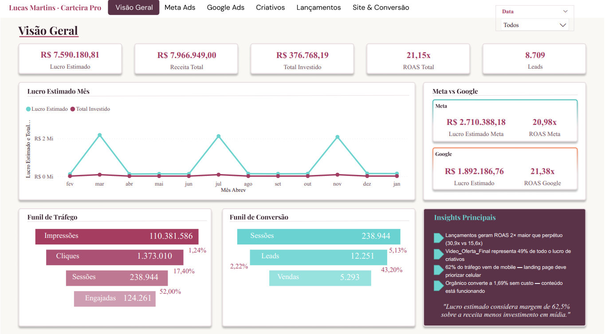
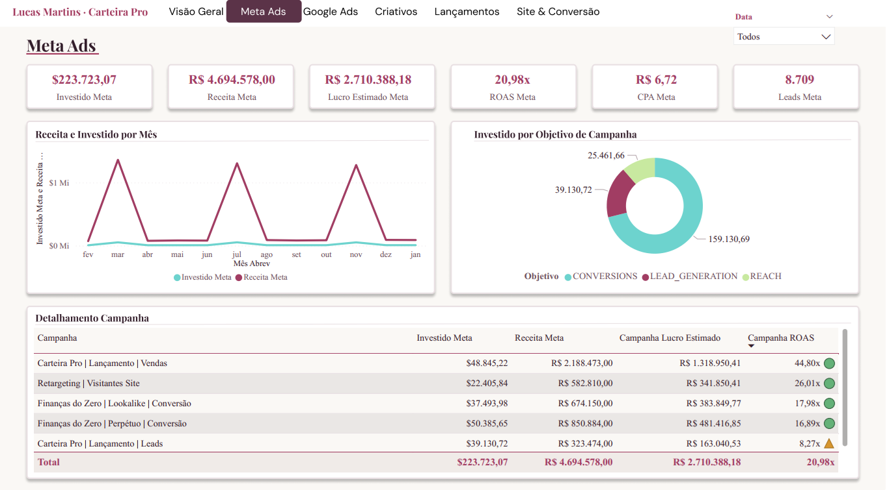
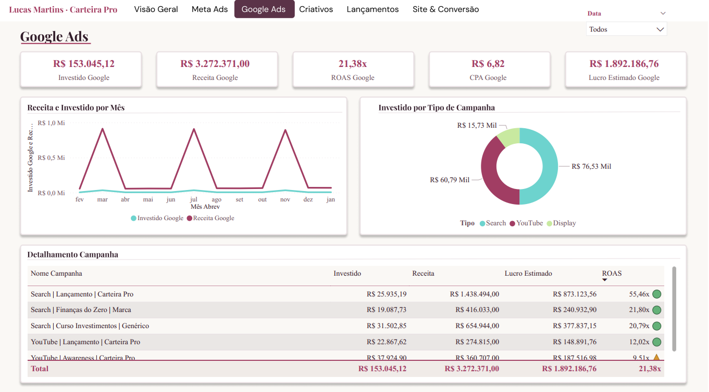
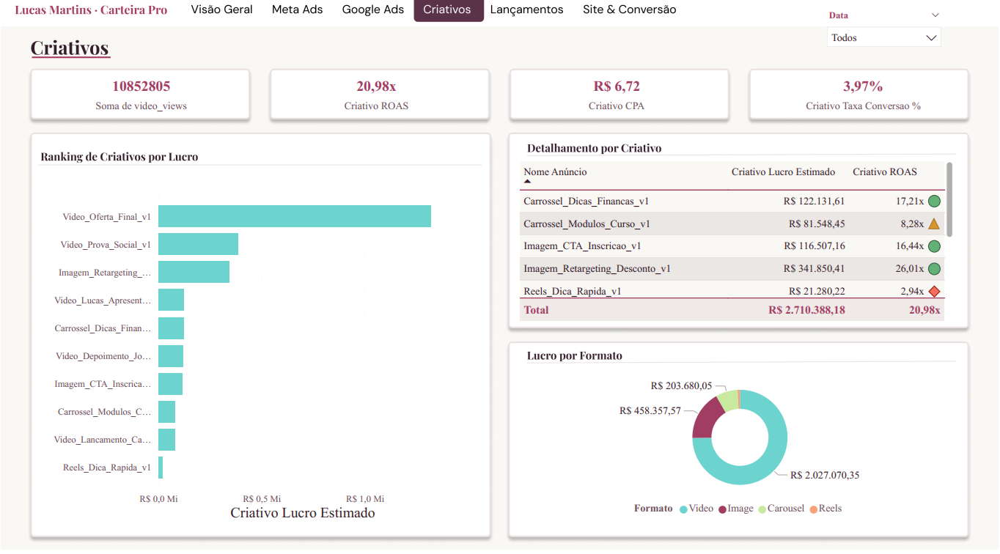
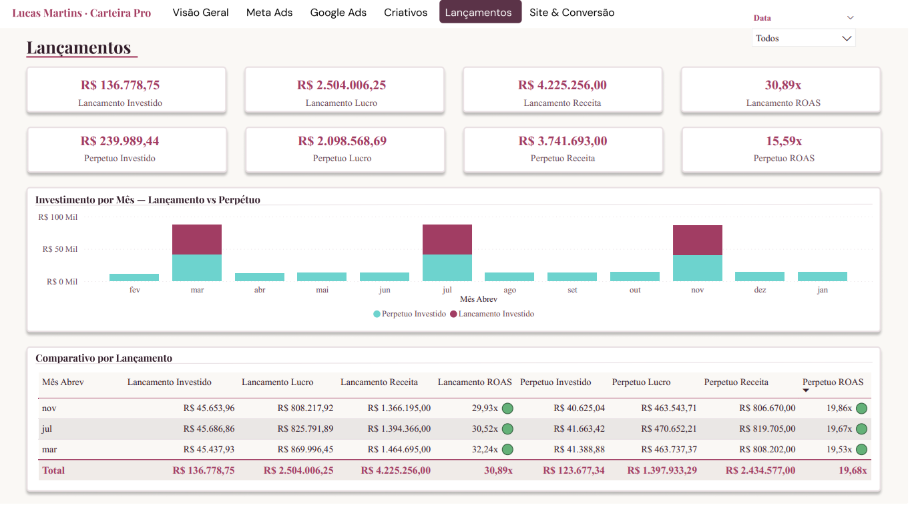
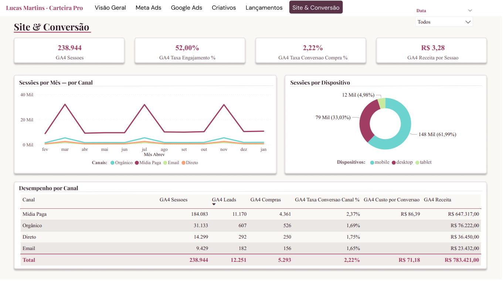

# lucas-martins-marketing-analytics
<div align="center">


</div>

<br/>

<div align="center">


</div>

<div align="center">

🔗 **[Acessar Dashboard no Power BI Service](https://app.powerbi.com/reportEmbed?reportId=eb574926-05ef-4115-aa11-35d76b3f8ce8&autoAuth=true&ctid=57d2ea99-01a6-4ab8-86bb-75c0642ef771)**

</div>

---

## 🎯 O Problema

**Lucas Martins** é influenciador de finanças pessoais e vende o curso *Carteira Pro* via tráfego pago no Meta Ads e Google Ads. Com investimento mensal relevante em mídia, ele tomava decisões baseadas em métricas isoladas de cada plataforma — sem visibilidade consolidada sobre o que realmente gerava **lucro**, não apenas receita.

As perguntas que ficavam sem resposta:

> *Onde devo concentrar o orçamento no próximo ciclo?*
> *Lançamento ou campanha perpétua entrega mais retorno?*
> *Qual criativo escalar e qual pausar?*
> *O site está convertendo bem o tráfego gerado pelos anúncios?*

**A solução:** um dashboard unificado em Power BI conectando Meta Ads, Google Ads e GA4 — projetado para que qualquer decisão estratégica pudesse ser tomada **em menos de 2 minutos de leitura**, sem jargão técnico.

---

## 📊 Dados do Projeto

| Dimensão | Detalhe |
|----------|---------|
| **Período** | Fevereiro/2024 — Janeiro/2025 (12 meses) |
| **Fontes** | Meta Ads · Google Ads · Google Analytics 4 |
| **Arquivos** | `meta_ads_data.csv` · `google_ads_data.csv` · `ga4_data.csv` |
| **Granularidade** | Diária por campanha e criativo |
| **Modelo** | Star Schema — 3 tabelas fato + 4 dimensões |
| **Medidas DAX** | 106 medidas em 11 pastas de exibição |

> ⚠️ **Os dados utilizados são sintéticos**, gerados para simular 12 meses reais de operação de um infoprodutor brasileiro. Valores e campanhas são plausíveis mas não representam dados reais de Lucas Martins.

---

## ⚙️ Arquitetura do Modelo

```
Tabelas Fato
  ├── meta_ads_data       ← campanhas, conjuntos e criativos do Meta
  ├── google_ads_data     ← Search, YouTube e Display do Google
  └── ga4_data            ← sessões, canais, dispositivos e conversões

Tabelas Dimensão
  ├── Calendário          ← com flag "É Mês de Lançamento" e Ordem Cronológica
  ├── Canais              ← de-para de medium GA4 para português
  ├── Funil Tráfego Etapas
  └── Funil Conversão Etapas
```

**ETL — Power Query:**
- ✅ Padronização de datas, moedas e inteiros
- ✅ Tabela Calendário com `Ordem Cronológica` para ordenação correta dos meses
- ✅ Flag `É Mês de Lançamento` para segmentar análises de lançamento vs. perpétuo
- ✅ Tabela `Canais` com normalização do `medium` do GA4 para português

---

## 📐 KPIs e Métricas

| Métrica | Fórmula | Para que serve |
|---------|---------|----------------|
| **Lucro Estimado** | `Receita / 1,6 − Investido` | Retorno real após custo do produto — mais honesto que receita bruta |
| **ROAS** | `Receita / Investido` | Semáforo de escala: >10x = escalar · 5–10x = observar · <5x = pausar |
| **CPA** | `Investido / Conversões` | Custo por venda — eficiência de campanha |
| **CPL** | `Investido / Leads` | Custo por lead nas campanhas de geração de cadastro |
| **Margem Estimada %** | `Lucro / Receita` | Rentabilidade real da operação de mídia |
| **Lançamento vs Perpétuo ROAS** | Comparativo | Onde alocar mais orçamento? |
| **GA4 Taxa de Conversão** | `Compras / Sessões` | O site converte bem o tráfego pago? |
| **GA4 Receita por Sessão** | `Receita / Sessões` | Quanto vale investir por clique? |
| **Criativo ROAS** | ROAS por anúncio | Identifica vencedores para escalar e perdedores para pausar |

---

## 🖥️ Estrutura do Dashboard — 6 páginas

Cada página do dashboard foi desenhada para responder **uma pergunta de negócio específica**:

| Página | Pergunta respondida |
|--------|---------------------|
| 1 — Visão Geral | Como está o negócio como um todo? |
| 2 — Meta Ads | Quais campanhas do Meta devo escalar ou pausar? |
| 3 — Google Ads | Como está a performance das campanhas no Google? |
| 4 — Criativos | Qual criativo está gerando mais lucro? |
| 5 — Lançamentos | Lançamento ou perpétuo entrega mais retorno? |
| 6 — Site & Conversão | O site está convertendo bem o tráfego dos anúncios? |

---

## 💡 Principais Insights

### Insight 1 — Lançamentos são o motor do negócio
Campanhas de lançamento entregaram **ROAS de 30,9x** contra 15,6x do perpétuo — o dobro de eficiência com investimento similar (~R$ 45K por lançamento). Com 3 lançamentos em 12 meses, essa estratégia respondeu por **R$ 2,5 Mi dos R$ 4,6 Mi de lucro total**.

📌 *Dobrar o investimento no próximo lançamento é a decisão com maior potencial de retorno imediato.*

---

### Insight 2 — Um criativo concentra quase metade do lucro de mídia
O `Video_Oferta_Final_v1` gerou **ROAS de 44,8x** e **R$ 1,32 Mi de lucro** — mais que o dobro da média dos demais criativos. Vídeos representam **74,8% do lucro total** de criativos.

📌 *Entender o que torna esse vídeo eficaz (oferta, gatilho, formato) é prioridade estratégica antes do próximo lançamento.*

---

### Insight 3 — 62% do tráfego é mobile, mas a conversão está abaixo do potencial
A maior parte dos usuários acessa pelo celular, mas a taxa de conversão geral é de apenas **2,22%**, indicando que a landing page pode não estar otimizada para mobile.

📌 *Otimizar a experiência mobile pode aumentar vendas sem aumentar nenhum investimento em mídia.*

---

### Insight 4 — Canal orgânico converte sem custo
O canal orgânico gerou **31 mil sessões** e **R$ 76 Mil em receita** com taxa de conversão de 1,69% — sem nenhum investimento em mídia paga.

📌 *Mais conteúdo orgânico aumenta receita com custo zero, reduzindo dependência de tráfego pago.*

---

### Insight 5 — Google Search de lançamento tem o melhor ROAS do portfólio
A campanha `Search | Lançamento | Carteira Pro` entregou **55,5x de ROAS** — o maior de todas as 12 campanhas nas duas plataformas. Captura intenção de compra no pico do lançamento com altíssima eficiência.

📌 *Essa campanha merece orçamento prioritário em todo lançamento.*

---

## 📸 Screenshots do Dashboard

**Página 1 — Visão Geral**


---

**Página 2 — Meta Ads**


---

**Página 3 — Google Ads**


---

**Página 4 — Criativos**


---

**Página 5 — Lançamentos**


---

**Página 6 — Site & Conversão**


---

## 🛠️ Stack Técnico

```
Visualização          →  Power BI Desktop + Power BI Service
ETL                   →  Power Query (M)
Medidas               →  DAX (106 medidas | 11 pastas de exibição)
Arquitetura           →  Star Schema (3 fatos + 4 dimensões)
Fontes de Dados       →  Meta Ads CSV · Google Ads CSV · GA4 CSV
```

---

## 📁 Estrutura do Repositório

```
lucas-martins-marketing-analytics/
│
├── README.md
├── Lucas Martins.pbix         ← Arquivo Power BI completo
└── assets/
    ├── images/                ← Screenshots das 6 páginas
    └── data/
        ├── meta_ads_data.csv
        ├── google_ads_data.csv
        └── ga4_data.csv
```

---

<div align="center">

> **Este projeto é um MVP de análise de marketing digital para infoprodutores.**
> Se você investe em tráfego pago e quer visibilidade real sobre o que gera lucro no seu negócio, [vamos conversar](https://www.linkedin.com/in/thalesmanetti/).

</div>

---

<div align="center">


**Thales Manetti** · [LinkedIn](https://www.linkedin.com/in/thalesmanetti/) · [Portfólio](https://thalesmanetti.github.io)

</div>
